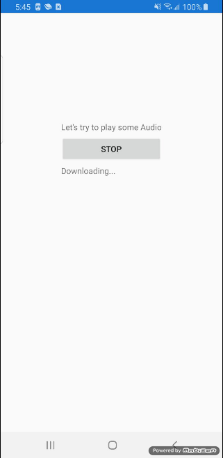
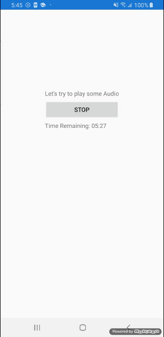
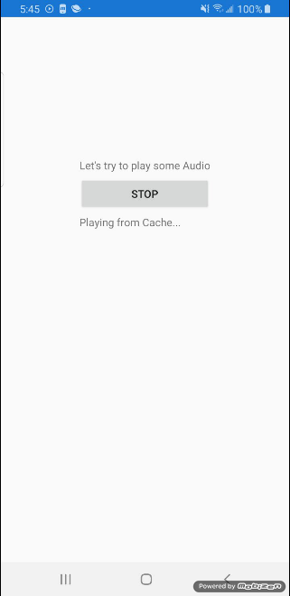
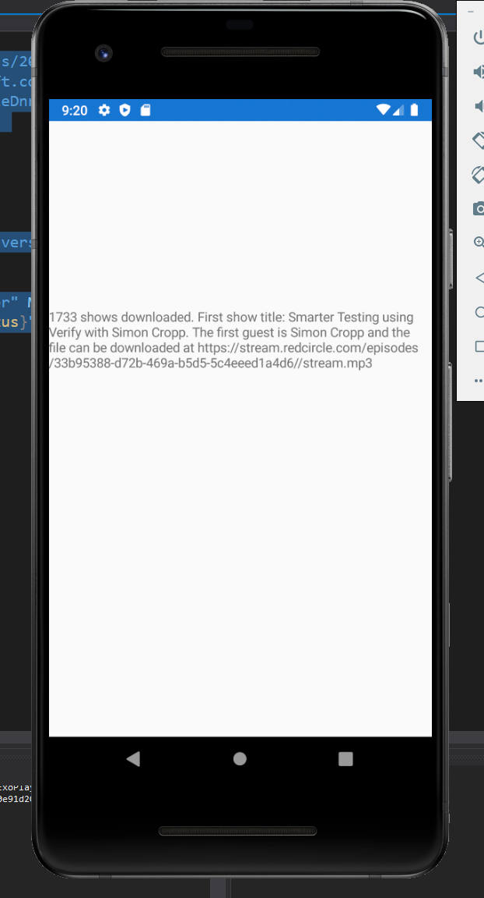
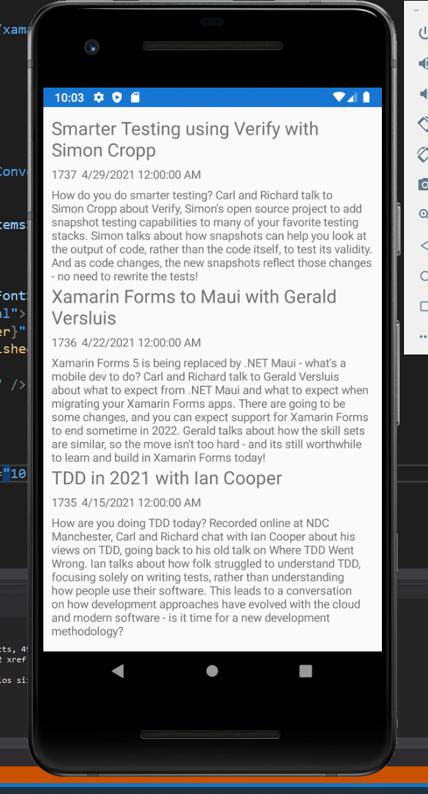
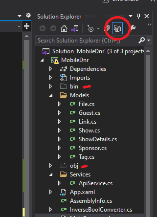
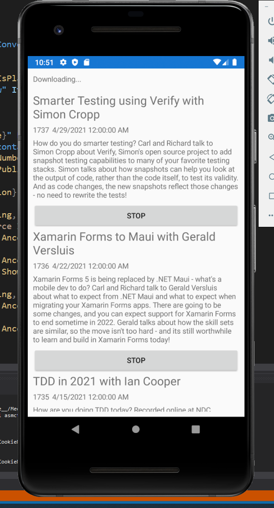

# The .NET Show Episode 3 

###### Building a Mobile Podcast App Part 2

See more projects at https://github.com/carlfranklin/DotNetShow

Watch the video at 

All episodes are listed at https://thedotnetshow.com

## Overview

Starting with episode 2 of The .NET Show, I am building a mobile podcast app for my podcast, .NET Rocks! using Xamarin Forms. 

### Step 4: Offline Support

One big reason for using a podcast player app is offline support, or being able to listen to episodes when you have no Internet connection. For this feature we need to turn 

We're going to use a library called MonkeyCache to achieve this.

Add the following NuGet package to all three projects:

```
MonkeyCache.FileStore
```

Add the following using statements to the *MainViewModel.cs* class:

```c#
using MonkeyCache.FileStore;
using System.IO;
using System.Net;
using Xamarin.Essentials;
```

##### Explicit Downloading

In this step we need code to download our mp3 into a cache directory, which is cleverly provided by `Xamarin.Essentials`.

Add this to the top of the `MainViewModel` class right under the definition of the `url` string:

```c#
string CacheDir = "";
```

Next, let's modify the constructor:

```c#
public MainViewModel()
{
    Barrel.ApplicationId = "mobile_dnr";
    CacheDir = FileSystem.CacheDirectory;
    CrossMediaManager.Current.PositionChanged += Current_PositionChanged;
    CrossMediaManager.Current.MediaItemFinished += Current_MediaItemFinished;
}
```

We really only added two lines of code. The first line sets the `ApplicationId` for MonkeyCache. Since James Montemagno wrote this library, it's no surprise that he takes the monkey metaphor all the way through the product.  There are a few different providers for MonkeyCache, or ways to store data. We will be using the FileStore. He calls these different methods Barrels. Hence, we need to set the Application Id on the Barrel that we're using. This Id has to be unique. 

For more information on MonkeyCache, see the repo at https://github.com/jamesmontemagno/monkey-cache

The next line gets the cache directory for our app on our platform (whichever is running). The `FIleSystem.CacheDirectory` property is built into Xamarin Essentials. It's just one less thing we need to write platform-specific code for.

> ###### iOS
>
> On iOS, `CacheDirectory` points to The application's `CachesDirectory` folder.
>
> The contents are not backed up. What's more, the system can sometimes clear the contents of the CacheDirectory if disk space is running low. 
>
> More information about iOS file storage can be found at https://developer.apple.com/library/archive/documentation/FileManagement/Conceptual/FileSystemProgrammingGuide/FileSystemOverview/FileSystemOverview.html
>
> ###### Androd
>
> On Android, `CacheDirectory` points to `AppContext.CacheDir.AbsolutePath`
>
> More information about how Android stores files can be found at https://developer.android.com/training/data-storage

###### IsCached

We need a boolean to let us know whether the audio file is cached. Let's add a new property:

```c#
private bool isCached;
public bool IsCached { get => isCached; set => SetProperty(ref isCached, value); } 
```

In order to look for the file in the cache we need to know what the filename is without the URL address part, and the path to the file in the cache. We also need a System.IO.FileStream. Add these three lines to the top of the `MainViewModel`

```c#
string CachedFileName = "";
string FileNameOnly = "01-Garde1.mp3";
FileStream LocalFileStream = null;
```

Modify the constructor to put together the `CachedFileName` and set `IsCached` accordingly:

```c#
public MainViewModel()
{
    Barrel.ApplicationId = "mobile_dnr";
    CacheDir = FileSystem.CacheDirectory;
    CachedFileName = Path.Combine(CacheDir, FileNameOnly);
    CrossMediaManager.Current.PositionChanged += Current_PositionChanged;
    CrossMediaManager.Current.MediaItemFinished += Current_MediaItemFinished;

    // Does the file exist?
    if (File.Exists(CachedFileName))
    {
        // Yes! We are cached
        IsCached = true;
    }
}
```

Add this code for downloading our file:

```c#
public void DownloadFile(string Url)
{
    var Uri = new Uri(Url);

    WebClient webClient = new WebClient();
    using (webClient)
    {
        webClient.DownloadDataCompleted += (s, e) =>
        {
            File.WriteAllBytes(CachedFileName, e.Result);
            IsCached = true;
        };

        webClient.DownloadDataAsync(Uri);
    }
}
```

This method downloads the file from a Url, and stores it in the local cache folder. 

Finally, modify our `PerformPlay` method to play from the cache if the file is already downloaded:

```c#
private async Task PerformPlay()
{
    IsPlaying = true;

    if (!IsCached)
    {
        // Not in cache. Play from URL
        CurrentStatus = "Downloading...";
        await CrossMediaManager.Current.Play(url);
        // Download the file to the cache
        DownloadFile(url);
    }
    else
    {
        IsCached = true;
        // In the cache. Play local file
        CurrentStatus = "Playing from Cache...";
        LocalFileStream = File.OpenRead(CachedFileName);
        await CrossMediaManager.Current.Play(LocalFileStream, FileNameOnly);
    }
}
```

We also need to dispose the stream when we press `Stop`:

```c#
protected async Task PerformStop()
{
    IsPlaying = false;
    CurrentStatus = "";
    await CrossMediaManager.Current.Stop();

    if (LocalFileStream != null)
    {
        LocalFileStream.Dispose();
    }
}
```

And when the media file is finished playing:

```c#
private void Current_MediaItemFinished(object sender, 
        MediaManager.Media.MediaItemEventArgs e)
{
    CurrentStatus = "";
    IsPlaying = false;
    if (LocalFileStream != null)
    {
        LocalFileStream.Dispose();
    }
}
```

Just as before, when we click play, we first get this: 



After downloading (and caching) we see this:



The next time we play, we see this:



and then


We can test this by placing the phone (or emulator) in Airplane Mode. The file plays from the cache. If you have trouble setting Airplane Mode in the emulator, just disable your Internet connection once the app launches.

### Step 5 - Handling multiple files

So now, we are starting to go down the rabbit hole of dealing with multiple files in a list.  Obviously, the UI is going to change a lot, but first let's focus on downloading the data.

##### Add Models

First, let's add a `Models` folder to the `MobileDnr` project, and add a few model files:

*File.cs*

```C#
using System;
using System.Collections.Generic;
using System.Linq;
using System.Web;

namespace MobileDnr.Models
{
	public class File
	{
		public int Id { get; set; }
		public int ShowId { get; set; }
		public string Url { get; set; }
		public int Minutes { get; set; }
		public int Bytes { get; set; }
	}
}
```

*Guest.cs*

```c#
using Newtonsoft.Json;
using System;
using System.Collections.Generic;
using System.Linq;
using System.Net.Http;
using System.Threading.Tasks;
using System.Web;

namespace MobileDnr.Models
{
    public class Guest
    {
        public int Id { get; set; }
        public string Name { get; set; } = "";
        public string PhotoUrl { get; set; } = "";
        public string Bio { get; set; } = "";
        public string LastError { get; set; } = "";
        public string PhotoPath { get; set; } = "";
    }
}
```

*Link.cs*

```c#
using System;
using System.Collections.Generic;
using System.Linq;
using System.Web;

namespace MobileDnr.Models
{
	public class Link
	{
		public int Id { get; set; }
		public int ShowId { get; set; }
		public string Text { get; set; } = "";
		public string Url { get; set; } = "";
		public string LastError { get; set; } = "";
	}
}
```

*Show.cs*

```c#
using System;
using System.Collections.Generic;
using System.Linq;
using System.Web;

namespace MobileDnr.Models
{
    public class Show
    {
        public int Id { get; set; }
        public bool Enabled { get; set; }
        public int ShowNumber { get; set; }
        public string ShowTitle { get; set; } = "";
        public string Description { get; set; } = "";
        public DateTime DateRecorded { get; set; } = DateTime.Now;
        public DateTime DatePublished { get; set; } = DateTime.Now;

        public string ShowDateString { get; set; } = "";
        public string DayOfWeek { get; set; } = "";

        public string Notes { get; set; } = "";

        public ShowDetails ShowDetails { get; set; } = new ShowDetails();
        public string ListDisplayString
        {
            get
            {
                return ShowNumber.ToString() + " - " + ((DateTime)DatePublished).ToShortDateString() + " - " + ShowTitle;
            }
        }
    }
}
```

*ShowDetails.cs*

```c#
using System;
using System.Collections.Generic;
using System.Linq;
using System.Web;

namespace MobileDnr.Models
{
    public class ShowDetails
    {
        public ShowDetails()
        {
            Guests = new List<Guest>();
            Links = new List<Link>();
            Sponsors = new List<Sponsor>();
            Tags = new List<Tag>();
            File = new File();
        }

        public List<Guest> Guests { get; set; }
        public List<Sponsor> Sponsors { get; set; }
        public List<Link> Links { get; set; }
        public List<Tag> Tags { get; set; }
        public File File { get; set; }
    }
}
```

*Sponsor.cs*

```c#
using System;
using System.Collections.Generic;
using System.Linq;
using System.Web;

namespace MobileDnr.Models
{
    public class Sponsor
    {
        public int Id { get; set; }
        public string Name { get; set; } = "";
        public string BannerUrl { get; set; } = "";
        public string Blurb { get; set; } = "";
        public string LandingUrl { get; set; } = "";
        public string Copy { get; set; } = "";
        public string LastError { get; set; } = "";
    }
}
```

*Tag.cs*

```c#
using System;
using System.Collections.Generic;
using System.Linq;
using System.Web;

namespace MobileDnr.Models
{
	public class Tag
	{
		public int Id { get; set; }
		public string Text { get; set; } = "";
		public string LastError { get; set; } = "";
	}
}
```

##### Add an Api Service

Let's add a `Services` folder to the `MobileDnr` project and add *ApiService.cs* to it:

```c#
using System;
using System.Collections.Generic;
using System.Text;
using Newtonsoft.Json;
using MobileDnr.Models;
using System.Net.Http;
using System.Threading.Tasks;

namespace MobileDnr.Services
{
    public class ApiService
    {
        private HttpClient httpClient;
        private string ShowName = "dotnetrocks";
        string baseUrl = "https://pwopclientapi.azurewebsites.net/shows/";

        public ApiService()
        {
            httpClient = new HttpClient() { BaseAddress = new Uri(baseUrl) };
        }

        public async Task<List<Show>> GetAllShows()
        {
            string Url = ShowName;
            var result = await httpClient.GetAsync(Url);
            result.EnsureSuccessStatusCode();
            var response = await result.Content.ReadAsStringAsync();
            return JsonConvert.DeserializeObject<List<Show>>(response);
        }

        public async Task<int> GetCount()
        {
            string Url = $"{ShowName}/getcount";
            var result = await httpClient.GetAsync(Url);
            result.EnsureSuccessStatusCode();
            var response = await result.Content.ReadAsStringAsync();
            return Convert.ToInt32(response);
        }

        public async Task<List<Show>> GetRange(int FirstShowNumber, int LastShowNumber)
        {
            string Url = $"{ShowName}/{FirstShowNumber}/{LastShowNumber}/getrange";
            var result = await httpClient.GetAsync(Url);
            result.EnsureSuccessStatusCode();
            var response = await result.Content.ReadAsStringAsync();
            return JsonConvert.DeserializeObject<List<Show>>(response);
        }

        public async Task<ShowDetails> GetShowDetails(int ShowNumber)
        {
            string Url = $"{ShowName}/{ShowNumber}/getdetails";
            var result = await httpClient.GetAsync(Url);
            result.EnsureSuccessStatusCode();
            var response = await result.Content.ReadAsStringAsync();
            return JsonConvert.DeserializeObject<ShowDetails>(response);
        }
    }
}
```

`ApiService` calls a freely available endpoint in Azure that returns metadata for .NET Rocks! episodes.  Think of it like an RSS feed, but it also contains specific data for guests, sponsored ads, and of course, the file information.

##### Add support code to the ViewModel

Replace *MainViewModel.cs* with the following:

```c#
using System;
using System.Collections.Generic;
using System.Text;
using System.Runtime.CompilerServices;
using System.ComponentModel;
using MvvmHelpers;
using System.Windows.Input;
using MvvmHelpers.Commands;
using MediaManager;
using System.Threading.Tasks;
using MonkeyCache.FileStore;
using System.IO;
using System.Net;
using Xamarin.Essentials;
using System.Xml;
using MobileDnr.Services;
using MobileDnr.Models;
using System.Collections.ObjectModel;

namespace MobileDnr
{
    public class MainViewModel : BaseViewModel
    {
        string url = "https://pwop6300.blob.core.windows.net/mtfb/01-Garde1.mp3";
        string CacheDir = "";
        string CachedFileName = "";
        string FileNameOnly = "01-Garde1.mp3";
        FileStream LocalFileStream = null;
        ApiService ApiService = new ApiService();

        public MainViewModel()
        {
            Barrel.ApplicationId = "mobile_dnr";
            CacheDir = FileSystem.CacheDirectory;
            CachedFileName = Path.Combine(CacheDir, FileNameOnly);
            CrossMediaManager.Current.PositionChanged += Current_PositionChanged;
            CrossMediaManager.Current.MediaItemFinished += Current_MediaItemFinished;

            // Does the file exist?
            if (System.IO.File.Exists(CachedFileName))
            {
                // Yes! We are cached
                IsCached = true;
            }
            var t = Task.Run(() => LoadAllShows());
            t.Wait();
        }

        private async Task LoadAllShows()
        {
            AllShows = await ApiService.GetAllShows();
            AllShows[0].ShowDetails = await ApiService.GetShowDetails(AllShows[0].ShowNumber);
            CurrentStatus = $"{AllShows.Count} shows downloaded. First show title: {AllShows[0].ShowTitle}. " +
                $"The first guest is {AllShows[0].ShowDetails.Guests[0].Name} " +
                $"and the file can be downloaded at {AllShows[0].ShowDetails.File.Url}";
        }

        private void Current_PositionChanged(object sender, MediaManager.Playback.PositionChangedEventArgs e)
        {
            TimeSpan currentMediaPosition = CrossMediaManager.Current.Position;
            TimeSpan currentMediaDuration = CrossMediaManager.Current.Duration;
            TimeSpan TimeRemaining = currentMediaDuration.Subtract(currentMediaPosition);
            if (IsPlaying)
                CurrentStatus = $"Time Remaining: {TimeRemaining.Minutes:D2}:{TimeRemaining.Seconds:D2}";
        }

        private void Current_MediaItemFinished(object sender, MediaManager.Media.MediaItemEventArgs e)
        {
            CurrentStatus = "";
            IsPlaying = false;
            if (LocalFileStream != null)
            {
                LocalFileStream.Dispose();
            }
        }

        private bool isPlaying;
        public bool IsPlaying
        {
            get
            {
                return isPlaying;
            }
            set
            {
                SetProperty(ref isPlaying, value);
            }
        }

        private ICommand play;
        public ICommand Play
        {
            get
            {
                if (play == null)
                {
                    play = new AsyncCommand(PerformPlay);
                }

                return play;
            }
        }

        public void DownloadFile(string Url)
        {
            var Uri = new Uri(Url);

            WebClient webClient = new WebClient();
            using (webClient)
            {
                webClient.DownloadDataCompleted += (s, e) =>
                {
                    System.IO.File.WriteAllBytes(CachedFileName, e.Result);
                    IsCached = true;
                };

                webClient.DownloadDataAsync(Uri);
            }
        }

        private async Task PerformPlay()
        {
            IsPlaying = true;

            if (!IsCached)
            {
                // Not in cache. Play from URL
                CurrentStatus = "Downloading...";
                await CrossMediaManager.Current.Play(url);
                // Download the file to the cache
                DownloadFile(url);
            }
            else
            {
                // In the cache. Play local file
                CurrentStatus = "Playing from Cache...";
                LocalFileStream = System.IO.File.OpenRead(CachedFileName);
                await CrossMediaManager.Current.Play(LocalFileStream, FileNameOnly);
            }
        }

        private ICommand stop;
        public ICommand Stop
        {
            get
            {
                if (stop == null)
                {
                    stop = new AsyncCommand(PerformStop);
                }
                return stop;
            }
        }

        protected async Task PerformStop()
        {
            IsPlaying = false;
            CurrentStatus = "";
            await CrossMediaManager.Current.Stop();

            if (LocalFileStream != null)
            {
                LocalFileStream.Dispose();
            }
        }

        private string currentStatus;
        public string CurrentStatus { get => currentStatus; set => SetProperty(ref currentStatus, value); }

        private bool isCached;
        public bool IsCached { get => isCached; set => SetProperty(ref isCached, value); }

        private List<Show> allShows = new List<Show>();
        public List<Show> AllShows { get => allShows; set => SetProperty(ref allShows, value); }

    }
}
```

Notice that we have added an `AllShows` property as an `List<Show>`. This will hold all the metadata for each show.

The `LoadAllShows` method retrieves the data from the `ApiService` and sets the `CurrentStatus` string property to a message that shows information from the first show as well as the number of shows that were downloaded.

##### Update the MainPage.xaml file

```xaml
<?xml version="1.0" encoding="utf-8" ?>
<ContentPage xmlns="http://xamarin.com/schemas/2014/forms"
             xmlns:x="http://schemas.microsoft.com/winfx/2009/xaml" 
             xmlns:local="clr-namespace:MobileDnr"
             x:DataType="local:MainViewModel"
             x:Class="MobileDnr.MainPage">
    <ContentPage.BindingContext>
        <local:MainViewModel />
    </ContentPage.BindingContext>
    <ContentPage.Resources>
        <local:InverseBoolConverter x:Key="InverseBoolConverter"/>
    </ContentPage.Resources>
    <StackLayout>
        <StackLayout HorizontalOptions="Center" Margin="0,200,0,0">
            <Label Text="{Binding CurrentStatus}" />
        </StackLayout>
        
    </StackLayout>
</ContentPage>
```

I've just simplified this to show the `CurrentStatus`. 

Run the app and you should see something like this:




### Step 6 - Update the UI to list all the files.

Now that we have the data, we need to do some deep modifications of our application in order to view all this data.

##### Install the free DevExpress Xamarin Forms Tools

We're going to use the Xamarin Forms library from DevExpress, which is free, to create a nice User Interface for our podcast app. DevExpress has made these controls free until November, 2021 when .NET 6 comes out.

To use these controls, register by going to http://devexpress.com/freexamarin

You will be given instructions for adding the DevExpress NuGet feed to Visual Studio, and then you can use the NuGet Manager to install the following NuGet package:

```c#
DevExpress.XamarinForms.CollectionView
```

Next, let's change the UI to show some information for each show (episode):

```xaml
<?xml version="1.0" encoding="utf-8" ?>
<ContentPage xmlns="http://xamarin.com/schemas/2014/forms"
             xmlns:x="http://schemas.microsoft.com/winfx/2009/xaml" 
             xmlns:local="clr-namespace:MobileDnr"
             xmlns:dxcv="http://schemas.devexpress.com/xamarin/2014/forms/collectionview"
             x:Class="MobileDnr.MainPage">
    
    <ContentPage.BindingContext>
        <local:MainViewModel />
    </ContentPage.BindingContext>
    
    <ContentPage.Resources>
        <local:InverseBoolConverter x:Key="InverseBoolConverter"/>
    </ContentPage.Resources>
    
    <dxcv:DXCollectionView x:Name="MyCollectionView" ItemsSource="{Binding AllShows}">
        <dxcv:DXCollectionView.ItemTemplate>
            <DataTemplate>
                <StackLayout>
                    <Label Text="{Binding ShowTitle}" FontSize="Large"/>
                    <StackLayout Orientation="Horizontal">
                        <Label Text="{Binding ShowNumber}" />
                        <Label Text="{Binding DatePublished, StringFormat='Published {d}'}" />
                    </StackLayout>
                    <Label Text="{Binding Description}" />
                </StackLayout>
            </DataTemplate>
        </dxcv:DXCollectionView.ItemTemplate>
        <dxcv:DXCollectionView.Margin>
            <OnIdiom x:TypeArguments="Thickness" Phone="10,10,10,10" Tablet="71,0,0,0"/>
        </dxcv:DXCollectionView.Margin>
    </dxcv:DXCollectionView>
    
</ContentPage>
```

When you run the app it should look something like this:

### 


> TIP!
>
> If you get strange errors preventing Visual Studio from compiling, you may want to try deleting the `obj` and `bin` folders in your project(s). Select the `MobileDnr` project, then select the `Show All Files` button. You'll see the folders in the list. Just delete them.



### Step 7 - Implement code to play an episode mp3 file

So, now we have to modify our Play structure to handle any Url, not just the hard-coded one.

Let's start by changing our `PerformPlay` method to take a Url as a string parameter:

```c#
private async Task PerformPlay(string Url)
{
    IsPlaying = true;
    string FileNameOnly = Path.GetFileName(Url);
    CachedFileName = Path.Combine(CacheDir, FileNameOnly);

    if (!IsCached)
    {
        // Not in cache. Play from URL
        CurrentStatus = "Downloading...";
        await CrossMediaManager.Current.Play(Url);
        // Download the file to the cache
        DownloadFile(Url);
    }
    else
    {
        // In the cache. Play local file
        CurrentStatus = "Playing from Cache...";
        LocalFileStream = System.IO.File.OpenRead(CachedFileName);
        await CrossMediaManager.Current.Play(LocalFileStream, FileNameOnly);
    }
}
```

Rather than hard-coding the filename and the Cached file name, we will do that here based on the Url that gets passed in. That's really the only change.

Next we will change the `ICommand Play` object to take a string parameter:

```c#
public ICommand Play
{
    get
    {
        if (play == null)
        {
            play = new AsyncCommand<string>(PerformPlay);
        }

        return play;
    }
}
```

The only change here is `AsyncCommand(PerformPlay)` becomes `AsyncCommand<string>(PerformPlay)`

Now we can delete the `url` and `FileNameOnly` fields from the top of the ViewModel:

```c#
string CacheDir = "";
string CachedFileName = "";
FileStream LocalFileStream = null;
ApiService ApiService = new ApiService();

public MainViewModel()
{
    Barrel.ApplicationId = "mobile_dnr";
    CacheDir = FileSystem.CacheDirectory;
    CrossMediaManager.Current.PositionChanged += Current_PositionChanged;
    CrossMediaManager.Current.MediaItemFinished += Current_MediaItemFinished;

    // Does the file exist?
    if (System.IO.File.Exists(CachedFileName))
    {
        // Yes! We are cached
        IsCached = true;
    }
    var t = Task.Run(() => LoadAllShows());
    t.Wait();
}
```

That's enough change in the ViewModel for now. Let's look at the real changes, which are happening in *MainPage.xaml*

```xaml
<?xml version="1.0" encoding="utf-8" ?>
<ContentPage xmlns="http://xamarin.com/schemas/2014/forms"
             xmlns:x="http://schemas.microsoft.com/winfx/2009/xaml" 
             xmlns:local="clr-namespace:MobileDnr"
             xmlns:dxcv="http://schemas.devexpress.com/xamarin/2014/forms/collectionview"
             x:Class="MobileDnr.MainPage">

    <ContentPage.BindingContext>
        <local:MainViewModel />
    </ContentPage.BindingContext>

    <ContentPage.Resources>
        <local:InverseBoolConverter x:Key="InverseBoolConverter"/>
    </ContentPage.Resources>
    <StackLayout>
        <Label Margin="10,10,0,0"
               IsVisible="{Binding IsPlaying}" Text="{Binding CurrentStatus}" />
        <dxcv:DXCollectionView x:Name="MyCollectionView" 
                               ItemsSource="{Binding AllShows}">
            <dxcv:DXCollectionView.ItemTemplate>
                <DataTemplate>
                    <StackLayout>
                        <Label Text="{Binding ShowTitle}" FontSize="Large"/>
                        <StackLayout Orientation="Horizontal">
                            <Label Text="{Binding ShowNumber}" />
                            <Label Text="{Binding DatePublished, StringFormat='Published {d}'}" />
                        </StackLayout>
                        <Label Text="{Binding Description}" />
                        <Button Text="Play"
                            IsVisible="{Binding IsPlaying, 
                                Converter={StaticResource InverseBoolConverter},
                                Source={RelativeSource AncestorType={x:Type local:MainViewModel}}}"
                            Command="{Binding Play, 
                                Source={RelativeSource AncestorType={x:Type local:MainViewModel}}}" 
                            CommandParameter="{Binding ShowDetails.File.Url}" />
                        <Button Text="Stop" 
                            IsVisible="{Binding IsPlaying,
                                Source={RelativeSource AncestorType={x:Type local:MainViewModel}}}" 
                            Command="{Binding Stop,
                                Source={RelativeSource AncestorType={x:Type local:MainViewModel}}}" />
                    </StackLayout>
                </DataTemplate>
            </dxcv:DXCollectionView.ItemTemplate>
            <dxcv:DXCollectionView.Margin>
                <OnIdiom x:TypeArguments="Thickness" Phone="10,10,10,10" Tablet="71,0,0,0"/>
            </dxcv:DXCollectionView.Margin>
        </dxcv:DXCollectionView>
    </StackLayout>
</ContentPage>
```

I've wrapped everything in a `<StackLayout>` so I could add a label showing the `CurrentStatus` at the top.

##### Binding

We need to talk about binding here. The `DXCollectionView`is bound to the `AllShows` list in the viewmodel. Within each item, inside the `<DataTemplate>` the `{Binding}` refers to the Show itself, not the viewmodel. However, there are some properties that we need to access in the viewmodel, such as `IsVisible` and the `Play` command. In order to access the right data source, we set the `Source` property to `local:MainViewModel`

Also notice in the `Play` button definition, we are setting the `CommandParameter` to the url to the mp3 file:

```xaml
CommandParameter="{Binding ShowDetails.File.Url}"
```

This is how to pass parameters via commands into the viewmodel. 

When you run this now, you'll see something like this:


Press the `Play` button:



Notice the "Downloading..." status just as before. The same code is executing in the viewmodel.

After the file downloads, you'll see the familiar countdown and all the buttons turn to `Stop` buttons:


Now, this is a good start, but it is hardly ideal not just from a UI standpoint but a functionality standpoint. We shouldn't have hundreds of `Stop` buttons, for example. In the next episode we'll create an information page for each show. The button will bring us to this new page and immediately start playing. We will also be able to show information about the guest(s), and also navigate back to the home screen.

